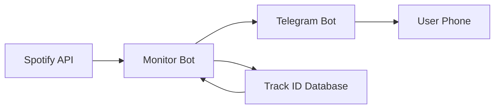

# 🎵 Spotify Playlist Telegram Bot

A Python bot that sends real-time Telegram notifications when new songs are added to your Spotify playlist. Never miss a new addition to your favorite playlists!

<div align="center">


*Beautiful formatted notifications with song details and Spotify links*
</div>

## 🚀 What It Does

- **Monitors** your Spotify playlist every few minutes
- **Detects** new songs in real-time using track ID comparison
- **Sends** formatted Telegram notifications
- **Includes** song details, album info, duration, and direct Spotify links
- **Runs** locally or on cloud servers for 24/7 monitoring

## 🛠️ The Journey: Challenges & Solutions

### 🎯 The Hard Parts

#### 1. **Spotify Authentication Nightmare**
```python
# The redirect URI struggle was REAL
SPOTIFY_REDIRECT_URI=http://127.0.0.1:8080  # ← This finally worked!
```
**Challenge:** Spotify's strict redirect URI requirements and HTTPS enforcement for local development.

**Solution:** Used `127.0.0.1` instead of `localhost` with HTTP, which Spotify accepts for local development.

#### 2. **Date Format Chaos**
```python
def parse_spotify_date(date_string):
    # Spotify uses TWO different date formats! 😫
    # 2023-11-04T04:46:19Z          (no milliseconds)
    # 2023-11-04T04:46:19.123Z      (with milliseconds)
```
**Challenge:** Spotify API returns dates in different formats randomly.

**Solution:** Created a robust parser that handles both formats gracefully.

#### 3. **Real-time Detection Logic**
```python
# Compare track IDs, not just counts!
current_track_ids = {track['id'] for track in current_tracks}
previous_track_ids = {track['id'] for track in self.previous_tracks}
new_track_ids = current_track_ids - previous_track_ids
```
**Challenge:** Simple track counting fails when users add AND remove songs.

**Solution:** Implemented track ID comparison for bulletproof detection.

#### 4. **Telegram Async Hell**
```python
# From async chaos...
❌ "coroutine was never awaited"

# To sync simplicity ✅
response = requests.post(url, json=payload, timeout=10)
```
**Challenge:** Python-Telegram-Bot's async complexity causing event loop issues.

**Solution:** Switched to direct Telegram API calls with `requests` for reliability.

## 📁 Project Structure

```
spotify-telegram-bot/
├── spotify_monitor.py     # 🎵 Main monitor bot
├── spotify_auth.py        # 🔐 Authentication setup
├── check_playlist.py      # 🔍 Debug playlist order
├── debug.py               # 🐛 System diagnostics
├── get_chat_id.py         # 💬 Get Telegram chat ID
└── .env                   # ⚙️ Configuration (gitignored)
```

### File Purposes:
- **`spotify_monitor.py`** - The brain: monitors playlist and sends notifications
- **`spotify_auth.py`** - Handles Spotify OAuth authentication flow
- **`check_playlist.py`** - Debugs track ordering and date parsing
- **`debug.py`** - Tests all system components
- **`get_chat_id.py`** - Simple utility to get your Telegram chat ID

## 🏗️ Architecture



## ⚡ Quick Start

### 1. **Configure Secrets**
```env
# .env file
TELEGRAM_BOT_TOKEN=your_bot_token
TELEGRAM_CHAT_ID=your_chat_id
SPOTIFY_CLIENT_ID=your_spotify_client_id
SPOTIFY_CLIENT_SECRET=your_spotify_secret
SPOTIFY_REDIRECT_URI=http://127.0.0.1:8080
SPOTIFY_PLAYLIST_ID=your_playlist_id
```

### 2. **Authenticate & Run**
```bash
python spotify_auth.py        # First-time Spotify auth
python spotify_monitor.py     # Start monitoring!
```

<div align="center">


*Real-time monitoring with detailed logging*
</div>

## 🌐 Deployment Options

### For 24/7 Monitoring:
- **PythonAnywhere** (Free tier) - Easy setup
- **Railway** - Modern deployment platform
- **Heroku** - Classic choice with free tier
- **Google Cloud Run** - Serverless and scalable

### Local Development:
```bash
# Run with shorter intervals for testing
python spotify_monitor.py  # Edit interval_minutes=0.1 for 6-second checks
```

## 🎓 Learning Outcomes

### Technical Skills Gained:
- **Spotify Web API** integration with OAuth 2.0
- **Telegram Bot API** with formatted messages and deep links
- **Async/Sync programming** patterns in Python
- **Error handling** for external API failures
- **Date parsing** and timezone management

### Problem-Solving Lessons:
- **API Limitations**: Working around Spotify's redirect URI restrictions
- **State Management**: Tracking playlist changes reliably
- **User Experience**: Creating informative notifications and error messages
- **Debugging**: Building diagnostic tools for complex API interactions

## 🔮 Future Enhancements

- **Multiple Playlist Support** - Monitor several playlists at once
- **Web Dashboard** - Visual interface for bot management
- **Rate Limit Optimization** - Smarter API call scheduling

## 📄 License

This project is licensed under the MIT License - see the [LICENSE.md](LICENSE.md) file for details.

## 🙏 Acknowledgments

- **Spotify** for their comprehensive Web API
- **Telegram** for their excellent bot platform
- **Python community** for the amazing libraries that made this possible

---

*"The music is not in the notes, but in the silence between." - Mozart*
